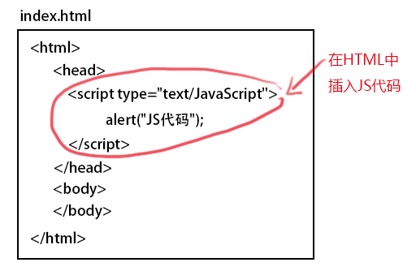
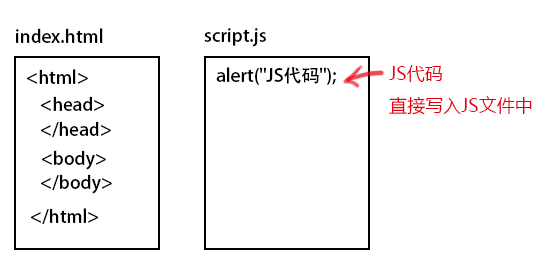
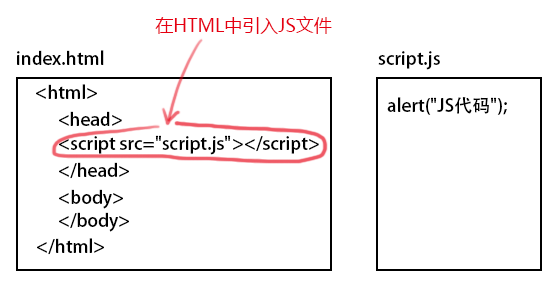
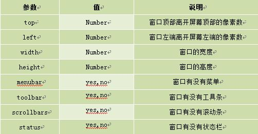
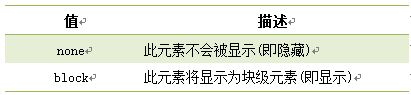

# JavaScript知识点  
1. 使用``之间。
2. **引用JS外部文件**  
我们知道使用``  
 
3. 单行注释，在注释内容前加符号 “//”。多行注释以"/*"开始，以"*/"结束。  
4. 定义变量使用关键字var,语法如下：  
##**var 变量名**  
变量名可以任意取名，但要遵循命名规则
   变量必须使用字母、下划线(_)或者美元符($)开始。
   然后可以使用任意多个英文字母、数字、下划线(_)或者美元符($)组成。
   不能使用JavaScript关键词与JavaScript保留字。
5. 如何定义一个函数呢？基本语法如下: 

  function 函数名()  

{  

     函数代码;  

}  

* document.write() 可用于直接向 HTML 输出流写内容。简单的说就是直接在网页中输出内容。  
* 第一种:输出内容用""括起，直接输出""号内的内容。
* 第二种:通过变量，输出内容
* 第三种:输出多项内容，内容之间用+号连接。
* 第四种:输出HTML标签，并起作用，标签使用""括起来。  
  
##JavaScript-警告（alert 消息对话框）  
语法:
alert(字符串或变量);  注:alert弹出消息对话框(包含一个确定按钮) 。  
##JavaScript-确认（confirm 消息对话框）  
`confirm(str);`  
看下面的代码:
``  
##JavaScript-提问（prompt 消息对话框）   
语法:  
prompt(str1, str2);    

参数说明：  
str1: 要显示在消息对话框中的文本，不可修改  
str2：文本框中的内容，可以修改  

返回值:  
点击确定按钮，文本框中的内容将作为函数返回值  
点击取消按钮，将返回null  

看看下面代码:  
var myname=prompt("请输入你的姓名:");  
if(myname!=null)  
  {   alert("你好"+myname); }  
else
  {  alert("你好 my friend.");  }  
##JavaScript-打开新窗口（window.open）  
  
语法：  
window.open([URL], [窗口名称], [参数字符串])  

参数说明:
URL：可选参数，在窗口中要显示网页的网址或路径。如果省略这个参数，或者它的值是空字符串，那么窗口就不显示任何文档。  

窗口名称：可选参数，被打开窗口的名称。  

    1.该名称由字母、数字和下划线字符组成。
    2."_top"、"_blank"、"_self"具有特殊意义的名称。
       _blank：在新窗口显示目标网页
       _self：在当前窗口显示目标网页
       _top：框架网页中在上部窗口中显示目标网页
    3.相同 name 的窗口只能创建一个，要想创建多个窗口则 name 不能相同。
   4.name 不能包含有空格。  

参数字符串：可选参数，设置窗口参数，各参数用逗号隔开。  
   
##JavaScript-关闭窗口（window.close）  
  
用法：  
window.close();   //关闭本窗口  
或
<窗口对象>.close();   //关闭指定的窗口  

例如:关闭新建的窗口。
``
注意:上面代码在打开新窗口的同时，关闭该窗口，看不到被打开的窗口。  
  
##通过ID获取元素  
  
语法:  

 `document.getElementById(“id”)`  
##改变 HTML 样式  
  语法:  
`Object.style.property=new style; `  
 
**注意:Object是获取的元素对象，如通过document.getElementById("id")获取的元素。**
  
`
`Hello World`
  `

 `  var mychar = document.getElementById("pcon");`
   `mychar.style.color="red";`
   `mychar.style.fontSize="20";`
   `mychar.style.backgroundColor ="blue";`
`</script>`  
  
##显示和隐藏（display属性）  
  
语法：  
`Object.style.display = value  `  
**注意:Object是获取的元素对象，如通过document.getElementById("id")获取的元素。**  
  
  
##控制类名（className 属性）  
  
语法：  
`object.className = classname`  
作用:  
1.获取元素的class 属性  
2. 为网页内的某个元素指定一个css样式来更改该元素的外观  
##window.onload的用法
[https://blog.csdn.net/nuan__nuan/article/details/72825719](https://blog.csdn.net/nuan__nuan/article/details/72825719 "window.onload的用法")  
